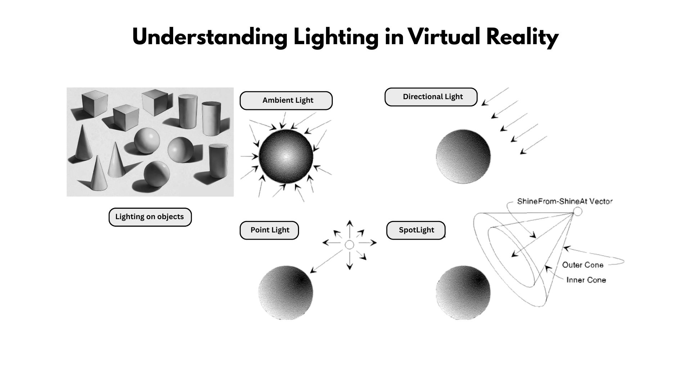

### Understanding Lighting in VR: Lighting on Objects

Lighting in virtual reality (VR) is crucial for creating immersive, believable environments that enhance storytelling, depth, mood, and narrative. Below is an explanation of how four key lighting types—Ambient Light, Point Light, Directional Light, and Spotlight—interact with objects in VR, focusing on their look and feel, and their contributions to storytelling, depth, and mood. These explanations consider the unique aspects of VR, such as real-time rendering and user immersion.

**Img. 1:** Different types of Lighting on an object

#### 1. Ambient Light
- **Look & Feel**: Ambient light provides uniform, non-directional illumination across the entire VR scene, acting as a baseline light level. It softens the environment, ensuring no area is completely dark, and creates a subtle glow or color tint that interacts with object materials (e.g., matte surfaces like wood or diffuse fabrics). In VR, ambient light is often used to simulate scattered environmental light, such as skylight or reflected light in a room.
- **Storytelling & Narrative**: Sets the environmental context, grounding the narrative in VR’s immersive space. For example, warm ambient light in a cozy virtual cabin conveys comfort, while dim, cool ambient light in a sci-fi setting suggests isolation or tension. It supports the story by making the environment feel cohesive and lived-in.
- **Depth**: While ambient light reduces harsh shadows, it can flatten depth if overused. When balanced, it enhances material properties (e.g., subtle reflections on plastic or skin), maintaining spatial realism in VR’s 360-degree view.
- **Mood**: Warm ambient light feels inviting and nostalgic, ideal for serene VR experiences. Cool or low-intensity ambient light creates a somber, mysterious, or eerie atmosphere, enhancing suspenseful narratives.
- **VR Considerations**: In VR, ambient light must be carefully tuned to avoid washing out details, as users can view objects from any angle. It often relies on baked lighting or environment maps to maintain performance in real-time rendering.

#### 2. Point Light
- **Look & Feel**: A point light emits light equally in all directions from a single point, like a light bulb or candle. It creates soft, radial illumination with natural falloff, casting dynamic shadows that emphasize object textures (e.g., rough surfaces like stone or smooth metals). In VR, point lights add localized realism, such as a glowing lantern in a dark forest.
- **Storytelling & Narrative**: Point lights draw attention to specific objects or areas, guiding the user’s focus in VR’s interactive environment. For example, a flickering point light on a desk might highlight a key narrative object, like a letter, enhancing the story’s progression. They create intimate or focused moments.
- **Depth**: By casting omnidirectional shadows, point lights enhance depth, making objects feel grounded. The interplay of light and shadow on materials (e.g., soft highlights on fabric) adds realism, crucial for VR immersion.
- **Mood**: Warm point lights (e.g., a campfire) evoke warmth and safety, while cold or dim point lights (e.g., a neon glow) suggest unease or futuristic settings.
- **VR Considerations**: Point lights are computationally intensive in VR due to real-time shadow casting. They’re often used sparingly or with baked shadows to maintain performance, ensuring smooth user experiences across all viewing angles.

#### 3. Directional Light
- **Look & Feel**: Directional light simulates a distant light source, like the sun, casting parallel rays across the scene. It creates sharp, consistent shadows and strong highlights, defining object forms and material properties (e.g., glossy surfaces like glass or matte surfaces like concrete). In VR, it provides a sense of global illumination, mimicking natural outdoor lighting.
- **Storytelling & Narrative**: Directional light sets the time of day or environmental tone, anchoring the narrative. For instance, a warm, low-angle directional light can evoke a sunset, suggesting hope or closure, while a harsh midday light might intensify a dramatic confrontation. It guides the user’s perception of the VR world’s scale.
- **Depth**: Sharp shadows and consistent lighting direction enhance depth, making objects and environments feel expansive and three-dimensional. Material interactions, like specular highlights on metal, add realism.
- **Mood**: Bright, warm directional light feels uplifting and open, ideal for exploration-based VR experiences. Cooler or angled light creates tension or mystery, suitable for narrative-driven scenes.
- **VR Considerations**: Directional light is efficient in VR, as it requires fewer calculations than point lights. However, shadows must be optimized to avoid aliasing, ensuring clarity as users move through the scene.

#### 4. Spotlight
- **Look & Feel**: A spotlight emits focused light in a cone, like a flashlight or stage light, creating intense highlights and defined shadow edges. It emphasizes specific areas or objects, with materials like reflective metals or translucent skin showing dramatic effects. In VR, spotlights create dynamic, attention-grabbing effects, such as a beam illuminating a character.
- **Storytelling & Narrative**: Spotlights direct the user’s gaze, highlighting critical narrative elements (e.g., a spotlight on a statue in a VR puzzle game). They create dramatic or theatrical moments, enhancing storytelling by isolating key objects or characters in the immersive space.
- **Depth**: The focused beam and sharp shadows add depth by creating strong contrasts, making objects pop against the background. Material interactions, like glossy highlights or soft diffusion, enhance realism.
- **Mood**: Bright, warm spotlights feel intense or celebratory, while narrow, cold beams evoke suspense or danger, amplifying VR’s emotional impact.
- **VR Considerations**: Spotlights require careful placement in VR to avoid disorienting users, as the focused beam can feel unnatural if misaligned with the user’s perspective. Real-time shadows must be optimized for performance.

#### Materials and Shadows
- **Materials**: Lighting in VR interacts with materials to enhance immersion. Reflective materials (e.g., metal or water) catch highlights from directional or spotlights, adding realism. Diffuse materials (e.g., cloth or wood) soften light, creating a grounded feel. Translucent materials (e.g., glass or skin) glow under point or spotlights, enhancing emotional or ethereal effects in VR’s close-up views.
- **Shadows**: Shadows are vital for depth and realism in VR. Hard shadows (from directional or spotlights) create dramatic, defined effects, ideal for intense narratives. Soft shadows (from point or ambient lights) suggest calm or ambiguity, supporting subtle storytelling. Shadows reveal material textures, enhancing immersion as users view objects from multiple angles.

#### Summary
Each lighting type shapes the VR experience:
- **Ambient Light**: Grounds the environment, setting the mood and context with subtle illumination.
- **Point Light**: Adds localized realism, guiding focus and creating intimate or tense moments.
- **Directional Light**: Mimics natural light, enhancing depth and setting the narrative tone.
- **Spotlight**: Directs attention with dramatic, focused beams, amplifying storytelling and mood.

Together, these lighting types, combined with materials and shadows, create immersive VR environments that enhance storytelling, depth, and emotional impact. In VR, careful optimization ensures performance while maintaining visual fidelity across all user perspectives.
