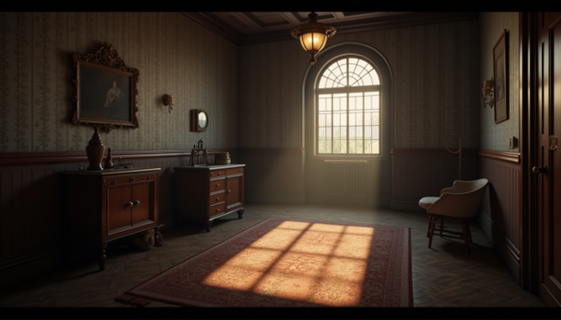
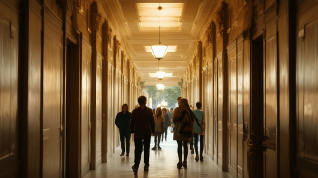
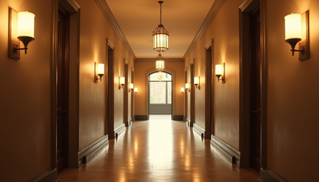
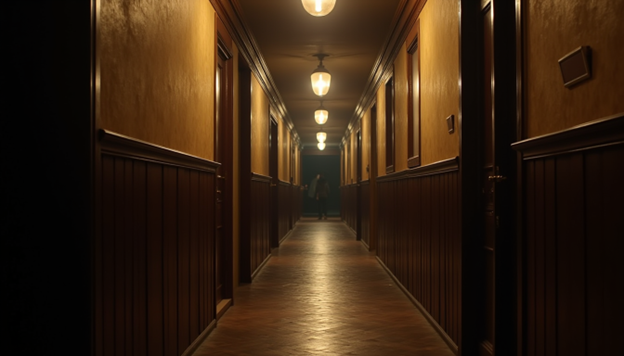
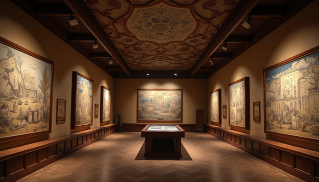
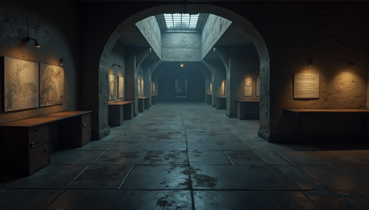
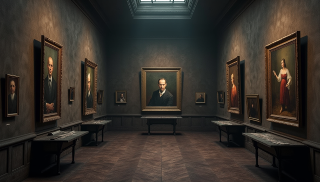

### Theory

Lighting plays a crucial role in Virtual Reality (VR), significantly impacting realism, immersion, mood, and user experience. A well-lit VR environment can make the virtual world feel more lifelike by accurately simulating how light interacts with objects, surfaces, and spaces. For instance, natural sunlight streaming through a window in a VR home simulation creates a sense of warmth and familiarity, while flickering neon signs in a cyberpunk city add to the futuristic atmosphere.

  
*Figure 1: Room-1*

  
*Figure 2: Room-2*

  
*Figure 3: Room-3*

Beyond realism, lighting also helps set the mood and tone of a scene. Warm, soft lighting can evoke a sense of comfort and relaxation, perfect for a VR meditation app, while dim, eerie lighting in a horror game builds suspense and tension. It also enhances storytelling by guiding users emotionally—think of how a sudden change from bright daylight to deep shadows can signal an upcoming dramatic moment.

  
*Figure 4: Corridor-1*

  
*Figure 5: Corridor-2*

  
*Figure 6: Corridor-3*

  
*Figure 7: Corridor-4*

Depth perception in VR is another key aspect influenced by lighting. Shadows, highlights, and gradients help users understand spatial relationships within a scene. For example, in a VR escape room, soft shadows cast by furniture and objects help define their shapes and distances, making navigation more intuitive. Additionally, lighting is an effective tool for directing user attention. Spotlights can highlight interactive objects in a puzzle game, while well-lit pathways naturally guide players toward objectives in an open-world experience.

  
*Figure 8: Depth*

Interactivity further enhances realism in VR through dynamic lighting that reacts to user actions. A flashlight illuminating dark corners as a player explores a haunted house or car headlights adjusting as a user navigates a virtual city are perfect examples of how real-time lighting makes VR experiences feel responsive and immersive. However, achieving realistic lighting while maintaining smooth performance requires optimization. Techniques like baked lighting—where shadows and global illumination are precomputed—ensure high-quality visuals without overloading the hardware, making it ideal for static environments like architectural walkthroughs.

  
*Figure 9: Interactivity*

Different types of lights serve unique purposes in VR. Directional light simulates sunlight and affects an entire scene uniformly, while point lights, like bulbs, cast illumination in all directions from a specific point. Spotlights create focused beams, useful for stage lighting or flashlights in dark settings. Ambient light ensures no part of a scene is entirely dark, providing a base level of illumination, while area lights mimic large sources like windows or ceiling panels for a more natural look. Advanced techniques such as global illumination simulate how light bounces off surfaces, adding realism by creating soft lighting and natural shadows. Volumetric lighting, like sunlight streaming through a dusty window, enhances atmosphere and visual depth.

  
*Figure 10: Portraits*

Shadows also contribute to realism in VR. Hard shadows have sharp edges, like those cast by a bright midday sun, while soft shadows, seen on a cloudy day, have diffused edges for a more natural look. Color temperature plays a role in setting the mood—warm hues (yellow, orange) create a cozy environment, while cool tones (blue, white) convey a sterile or futuristic feel, such as in a VR medical simulation. Special lighting effects further enrich the experience—flickering lights add tension in horror games, dynamic color shifts match story progression, and realistic reflections and refractions bring elements like water and glass to life.

  
*Figure 11: Shadows*

High Dynamic Range (HDR) lighting enhances contrast between bright and dark areas, making outdoor scenes in VR appear more natural. Since VR hardware has performance limitations, optimized techniques like lightmaps and Level of Detail (LOD) ensure smooth performance without sacrificing visual quality. Developers use various tools to achieve these effects. Unity offers baked and real-time lighting tools, Unreal Engine provides advanced systems like ray tracing for hyper-realistic illumination, and Blender helps pre-light 3D models before importing them into VR environments.

  
*Figure 12: HDR*

Ultimately, lighting is one of the most powerful tools in VR design, shaping not just how a world looks but how users feel and interact with it. Whether it’s the soft glow of a sunset in a virtual beach retreat or the ominous flicker of a streetlamp in a dystopian city, lighting breathes life into virtual spaces, making them more engaging and believable.
